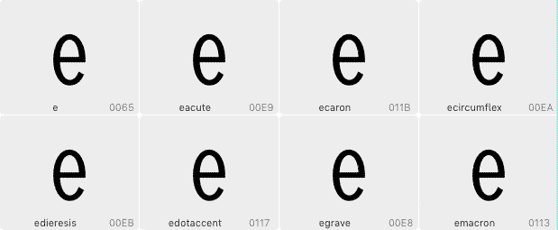

# BaseReductor

This is a filter plugin for the [Glyphs font editor](http://glyphsapp.com/). After installation, it will add the menu item *Filter > BaseReductor.* You can set a keyboard shortcut in System Preferences. The filter will reduce diacritics to their base glyphs, e.g. `äáàāą` will appear as `aaaa`. This can be useful for trial fonts.

This image best describes the before/after effect of BaseReductor:

### Installation

1. One-click install *BaseReductor* from *Window > Plugin Manager*
2. Restart Glyphs.

### Usage Instructions

1. Select any number of (compound diacritic) glyphs in Font view or Edit view.
2. Run *Filter > BaseReductor* to rid all your compounds of their accents.

### License

Copyright 2019 Rainer Erich Scheichelbauer (@mekkablue), after an idea by Grilli Type (@grillitype).
Based on sample code by Georg Seifert (@schriftgestalt) and Jan Gerner (@yanone).

Licensed under the Apache License, Version 2.0 (the "License");
you may not use this file except in compliance with the License.
You may obtain a copy of the License at

http://www.apache.org/licenses/LICENSE-2.0

See the License file included in this repository for further details.
